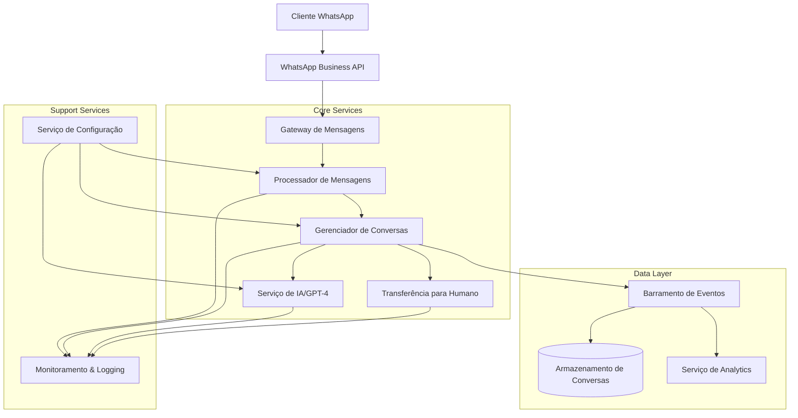

# Diagrama de Arquitetura de Alto Nível - Urbana Connect

## Componentes Principais

1. **Gateway de Mensagens**: Recebe e envia mensagens através da API do WhatsApp Business, atuando como ponto de entrada do sistema.

2. **Processador de Mensagens**: Analisa, filtra e encaminha mensagens recebidas para processamento adequado.

3. **Gerenciador de Conversas**: Mantém o estado das conversas, gerencia o contexto e orquestra o fluxo de comunicação.

4. **Serviço de IA/GPT-4**: Integra com a API da OpenAI para processamento de linguagem natural e geração de respostas.

5. **Transferência para Humano**: Gerencia a transição de conversas do bot para atendentes humanos quando necessário.

6. **Barramento de Eventos**: Facilita a comunicação assíncrona entre componentes através de eventos.

7. **Armazenamento de Conversas**: Persiste históricos de conversas e contextos no MongoDB.

8. **Serviço de Analytics**: Coleta e processa dados para análise de desempenho e insights.

9. **Monitoramento & Logging**: Fornece observabilidade através de logs estruturados e métricas.

10. **Serviço de Configuração**: Gerencia configurações centralizadas para todos os componentes. 