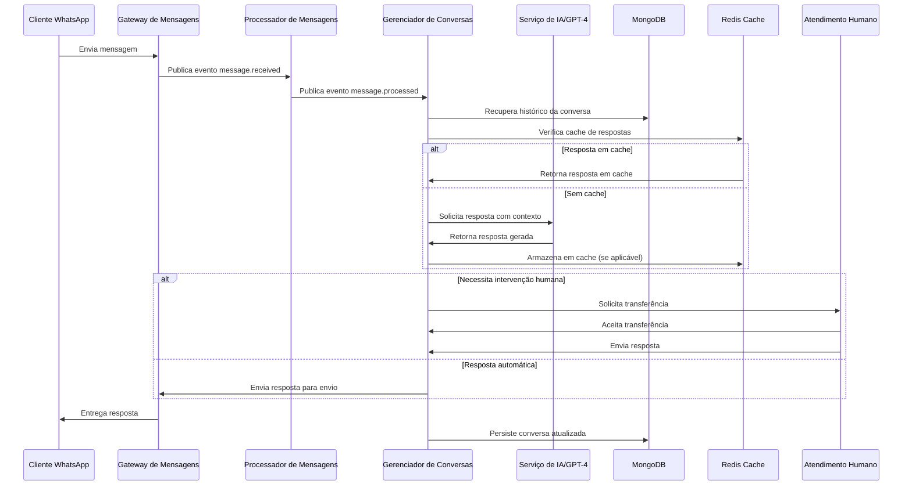

# Fluxo de Dados - Urbana Connect

## Diagrama de Fluxo de Processamento de Mensagens

## Fluxo de Dados Detalhado

### 1. Recebimento de Mensagem

1. Cliente envia mensagem via WhatsApp
2. WhatsApp Business API encaminha a mensagem para o webhook do Gateway
3. Gateway valida a assinatura e autenticidade da mensagem
4. Gateway publica um evento `message.received` no barramento de eventos
5. Gateway confirma recebimento para a API do WhatsApp

### 2. Processamento da Mensagem

1. Processador de Mensagens consome o evento `message.received`
2. Analisa o conteúdo da mensagem (texto, mídia, localização)
3. Filtra mensagens indesejadas ou spam
4. Enriquece a mensagem com metadados (idioma, sentimento, intenção)
5. Publica um evento `message.processed` no barramento de eventos

### 3. Gerenciamento de Conversa

1. Gerenciador de Conversas consome o evento `message.processed`
2. Recupera o histórico da conversa do MongoDB
3. Atualiza o estado da conversa com a nova mensagem
4. Determina se a mensagem requer:
   - Resposta automática via IA
   - Transferência para atendimento humano
   - Ação específica (ex: processamento de pagamento)

### 4. Geração de Resposta

#### 4.1 Via IA (Caminho Principal)

1. Gerenciador de Conversas verifica cache de respostas no Redis
2. Se não encontrada em cache:
   - Prepara o contexto da conversa para o GPT-4
   - Solicita resposta ao Serviço de IA
   - Serviço de IA otimiza o prompt e chama a API da OpenAI
   - Serviço de IA processa a resposta e retorna ao Gerenciador
   - Gerenciador armazena resposta em cache (se aplicável)
3. Gerenciador publica evento `response.generated`

#### 4.2 Via Atendimento Humano (Caminho Alternativo)

1. Gerenciador detecta necessidade de intervenção humana
2. Publica evento `handoff.requested`
3. Serviço de Transferência para Humano:
   - Notifica atendentes disponíveis
   - Coloca conversa em fila de atendimento
   - Fornece contexto da conversa ao atendente
4. Atendente humano responde via interface
5. Serviço de Transferência publica evento `response.generated`

### 5. Entrega da Resposta

1. Gateway de Mensagens consome evento `response.generated`
2. Formata a resposta conforme especificações do WhatsApp
3. Envia a resposta via API do WhatsApp Business
4. Recebe confirmação de entrega
5. Publica evento `message.delivered`

### 6. Persistência e Analytics

1. Gerenciador de Conversas persiste a conversa atualizada no MongoDB
2. Serviço de Analytics consome eventos relevantes
3. Processa métricas e insights
4. Atualiza dashboards e relatórios

## Fluxos Especiais

### Timeout e Recuperação

1. Se qualquer componente não responder dentro do timeout:
   - Circuit breaker interrompe a operação
   - Sistema tenta caminho alternativo (fallback)
   - Evento de erro é publicado para logging
   - Retry é agendado com backoff exponencial

### Detecção de Intenção de Transferência

1. Serviço de IA detecta solicitação de falar com humano
2. Marca a mensagem com flag de "transferência solicitada"
3. Gerenciador de Conversas inicia processo de transferência
4. Sistema envia mensagem de confirmação ao usuário

### Reconciliação de Estado

1. Periodicamente, o sistema executa reconciliação:
   - Verifica conversas "presas" em estados intermediários
   - Resolve inconsistências entre componentes
   - Recupera conversas interrompidas
   - Limpa recursos de conversas expiradas 