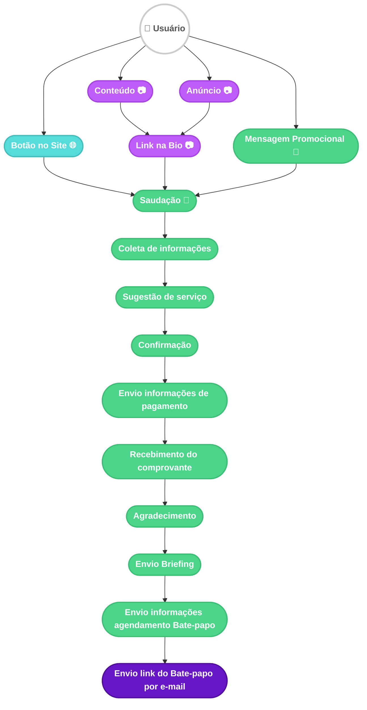

# Fluxograma de Mensagens - Aquisição e Conversão

Este documento contém o fluxograma que mapeia as origens de clientes e a jornada automatizada da **Urba**, desde a captação até a marcação do bate-papo.

## Legenda
- **🟢 Verde**: Urba (Chatbot)
- **🟣 Lilás**: Agente Humano
- **🟣 Roxo Escuro**: Automação Google
- **🌐 Ciano**: Canal Web (Botão no Site)

## Diagrama

