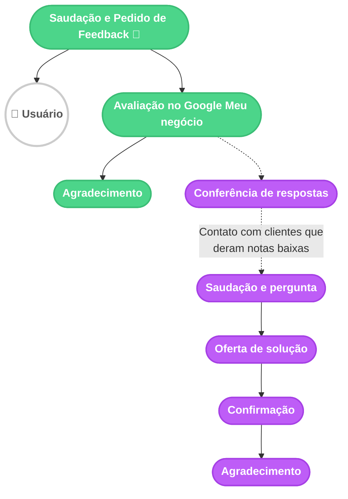

# Fluxograma de Mensagens - Coleta de Feedback

Este documento contém o fluxograma que mapeia o processo de coleta de feedback da **Urba**, desde o contato automatizado até o acionamento do Agente Humano em caso de notas baixas.

## Legenda
- **🟢 Verde**: Urba (Chatbot)
- **🟣 Lilás**: Agente Humano

## Diagrama

