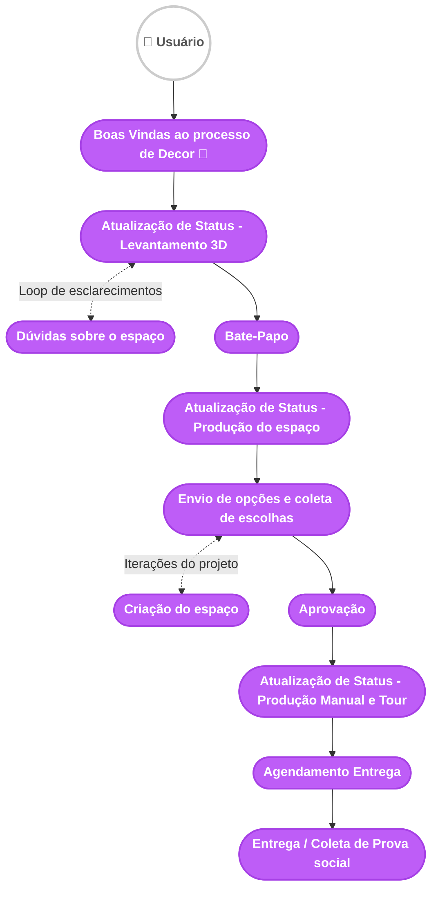

# Fluxograma de Mensagens - Decor e Coleta de Prova Social

Este documento contém o fluxograma que mapeia o processo de execução do serviço Decor, englobando as etapas de atendimento humano, aprovação de entregáveis e, por fim, a coleta de prova social e entrega final.

## Legenda
- **🟢 Verde**: Urba (Chatbot) - *Sem ação neste macro-fluxo*
- **🟣 Lilás**: Agente Humano

## Diagrama

