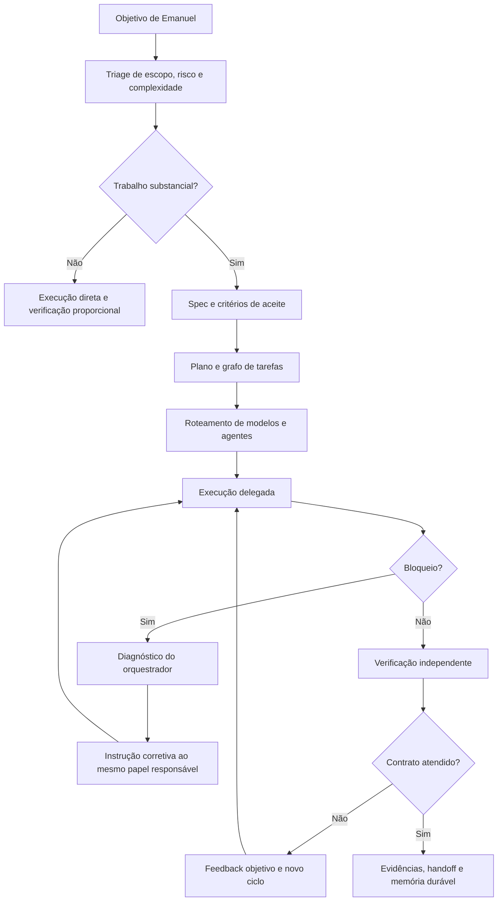

# Plano do Codex Engineering Orchestrator

## Metadados

- `Status`: aplicado no projeto e promovido para configuração global; piloto operacional em observação
- `Data`: 2026-08-04
- `Responsável pela direção`: Emanuel
- `Escopo`: comportamento global do Codex como orquestrador de atividades de engenharia
- `Projeto piloto`: `urbana-connect`
- `Dependência futura`: memória durável descrita em `docs/plans/obsidian-memory-and-orchestration.md`

## Estado aplicado em 2026-08-04

- `AGENTS.md` do `urbana-connect` atualizado para os cinco papéis, SDD/TDD, QA independente, roteamento e limite de três subagentes;
- `~/.codex/AGENTS.md` criado com o comportamento global do Tech Lead Orchestrator;
- skill global `~/.codex/skills/engineering-orchestrator/` criada e validada;
- perfis globais `explorer`, `developer`, `staff_engineer` e `qa_tester` criados em `~/.codex/agents/`;
- default global alterado para `gpt-5.6-sol` com esforço `high`;
- feature `multi_agent` habilitada explicitamente;
- settings `[agents]` habilitados com limite de três threads, fallback Terra Medium e interrupções visíveis;
- perfis testados em nova execução do binário do Codex Desktop: Explorer, Developer e QA em Luna Max; Staff em Sol XHigh;
- descoberta das orientações global e local e da skill confirmada em nova execução;
- nenhum deploy, PR, Jira ou alteração operacional foi realizado.

Compatibilidade observada:

- o binário do Codex Desktop é `0.146.0-alpha.9.2` e suporta os perfis e settings modernos;
- o CLI standalone no `PATH` foi atualizado de `0.144.4` para `0.146.0` após liberação de espaço;
- o staging incompleto de 24 MiB da primeira tentativa foi removido antes da atualização bem-sucedida;
- Desktop e CLI standalone agora aceitam os settings escalares `[agents]`;
- perfis com modelo explícito continuam tendo precedência sobre o fallback global, conforme esperado.

## 1. Visão

Transformar a thread principal do Codex em um gerente técnico responsável por:

- compreender a intenção de Emanuel;
- estruturar especificações e critérios de aceite;
- decompor o trabalho em unidades verificáveis;
- selecionar agentes e modelos de acordo com complexidade, risco e custo;
- delegar execução com contratos claros;
- manter o contexto estratégico fora do ruído operacional;
- diagnosticar bloqueios devolvidos pelos papéis delegados;
- conduzir ciclos limitados de correção;
- revisar a implementação contra a especificação;
- executar ou conferir validações independentes;
- apresentar evidências antes de considerar o trabalho concluído.

O comportamento deverá ser aplicado por padrão em novas sessões e repositórios, sem obrigar o uso de múltiplos agentes em tarefas pequenas nas quais a delegação custaria mais do que ajudaria.

## 2. Resultado esperado

O sistema deverá implementar um loop de engenharia gerenciado:



## 3. Conclusões da pesquisa

### 3.1 O padrão correto é manager-style

A thread principal deve manter a propriedade da resposta, do plano e da decisão final. Os especialistas atuam como capacidades limitadas, não como novos donos da conversa.

Isso corresponde ao padrão “agents as tools” descrito na documentação da OpenAI: o gerente permanece responsável pela síntese final e chama especialistas para tarefas delimitadas.

Consequências:

- o agente principal não transfere a responsabilidade de conclusão;
- nenhum papel delegado declara sozinho que a entrega está pronta;
- decisões novas ou ambíguas voltam ao agente principal;
- somente o agente principal apresenta a conclusão a Emanuel;
- agentes subordinados retornam evidências e não apenas opiniões.

### 3.2 `AGENTS.md` pode autorizar delegação proativa

Versões locais atuais do Codex podem delegar quando:

- o usuário pede diretamente;
- um `AGENTS.md` aplicável manda delegar;
- uma skill aplicável manda delegar.

Portanto, é possível tornar a orquestração o comportamento padrão sem repetir a solicitação em toda thread.

### 3.3 Configuração global é carregada em novas execuções

O Codex lê `~/.codex/AGENTS.md` como orientação global antes dos arquivos específicos do repositório. A orientação é montada uma vez por execução ou sessão. Instruções mais próximas do diretório atual entram depois e podem especializar a regra global.

Implicações:

- o comportamento pode valer para todos os repositórios;
- uma sessão já aberta pode precisar ser reiniciada para receber uma alteração global;
- `AGENTS.override.md` pode substituir temporariamente a regra global;
- o arquivo global deve ser pequeno e estável;
- regras específicas de build, arquitetura e review continuam no projeto.

### 3.4 Agentes personalizados podem fixar modelos e papéis

Agentes pessoais podem ser definidos em `~/.codex/agents/*.toml`. Cada agente pode ter:

- nome e descrição;
- instruções próprias;
- modelo;
- esforço de raciocínio;
- sandbox;
- MCPs e skills específicos.

Isso é mais confiável do que pedir em linguagem natural, a cada spawn, que um agente “aja como worker econômico”.

### 3.5 Subagentes não são automaticamente econômicos

Cada subagente consome seus próprios tokens e ferramentas. Delegar indiscriminadamente pode gastar mais do que uma execução direta.

Os principais ganhos vêm de:

- isolar ruído e logs da thread principal;
- usar modelos menores em trabalho delimitado;
- paralelizar somente tarefas realmente independentes;
- passar contexto mínimo em vez de todo o histórico;
- reutilizar o mesmo papel durante correções;
- evitar que o modelo mais caro faça exploração mecânica.

### 3.6 Paralelismo é mais seguro para leitura

Exploração, pesquisa, triagem, análise de logs e execução independente de testes são bons candidatos a paralelismo.

Escritas paralelas no mesmo worktree aumentam risco de:

- conflitos;
- sobreposição de responsabilidade;
- testes em estado intermediário;
- perda de mudanças do usuário;
- necessidade de coordenação mais cara que o ganho de tempo.

O padrão inicial deve ser “múltiplos leitores, um escritor”.

### 3.7 O benchmark orienta, mas não decide sozinho

A imagem fornecida por Emanuel é uma evidência inicial de custo versus desempenho no benchmark disponível, não uma garantia universal para todo repositório. Ela não informa o conjunto de tarefas, a distribuição de dificuldade nem a variância por função. Portanto, o plano usa os números como hipótese de roteamento e exige validação no `urbana-connect`.

Leitura operacional do recorte apresentado:

- `gpt-5.6-sol [high]` é o melhor ponto de partida para a thread principal: qualidade suficiente para planejamento e revisão, com custo muito menor que `Sol [max]`;
- `gpt-5.6-sol [xhigh]` deve ser o escalonamento para ambiguidade, arquitetura, diagnóstico difícil e risco alto;
- `gpt-5.6-sol [max]` fica reservado para exceções em que o custo de uma falha justifique pagar aproximadamente 78% a mais que `Sol [xhigh]` por um ganho de PASS@1 de cerca de 2 pontos no recorte;
- `gpt-5.6-luna [max]` é o candidato de melhor custo-benefício para tarefas estreitas e bem especificadas, mas deve ser validado como trabalhador antes de receber autonomia ampla;
- `gpt-5.6-terra [max]` é o fallback de qualidade para tarefas que excedem a especialização do Luna ou exigem contexto mais amplo.

A documentação oficial também posiciona Sol para tarefas exigentes, Terra como alternativa forte de menor preço e Luna para tarefas eficientes e de alto volume. O router abaixo combina essa orientação com o benchmark fornecido, sempre com fallback por disponibilidade.

Neste ambiente atual, os overrides de subagente expostos à thread permitem Sol e Terra, mas não Luna. A configuração desejada pode apontar Luna nos perfis de worker, porém o piloto deve detectar a indisponibilidade e cair para Terra sem quebrar o fluxo.

### 3.8 Os cinco papéis do sistema

Os papéis são responsabilidades operacionais, não nomes de modelos:

1. **Tech Lead Orchestrator** — é a thread principal. Faz triage, conduz discovery, escreve ou aprova a spec, escolhe quem deve atuar, destrava problemas, valida o resultado e responde a Emanuel. Não precisa ser o melhor executor de cada tecnologia; precisa manter propriedade do objetivo e do loop.
2. **Staff Engineer** — especialista técnico acionado para decisões difíceis, arquitetura, investigação profunda e desbloqueios que exigem julgamento experiente. Pode revisar ou propor a solução, mas devolve a decisão ao Tech Lead.
3. **Developer** — único escritor padrão da implementação. Converte o contrato em código, escreve testes primeiro quando aplicável, executa a mudança e entrega evidências estruturadas.
4. **Explorer** — modo de investigação somente leitura. Mapeia o estado atual, pesquisa documentação, identifica invariantes e reduz incerteza. Não é o dono da discovery: o Tech Lead formula a pergunta e incorpora ou rejeita as evidências.
5. **QA Tester** — verificador independente. Executa testes, confere critérios de aceite, procura regressões e pode propor testes adicionais. A implementação continua sendo responsabilidade do Developer; QA não altera o mesmo escopo em paralelo.

O papel **Principal Engineer** fica fora da primeira versão. Quando surgir necessidade de visão transversal entre vários domínios, o Staff poderá receber esse mandato explicitamente, sem criar uma sexta função antes de haver evidência de que a distinção agrega valor.

## 4. Objetivos e não objetivos

### 4.1 Objetivos

- tornar a thread principal responsável por planejamento e qualidade;
- aplicar SDD antes de implementação relevante;
- aplicar TDD quando houver comportamento novo testável;
- reduzir uso de Sol em trabalho mecânico;
- tornar delegações observáveis e auditáveis;
- exigir evidência antes de conclusão;
- usar correções incrementais em vez de reiniciar trabalho;
- funcionar em novas sessões por padrão;
- preservar instruções e autonomia específicas do projeto;
- permitir evolução futura baseada em métricas.

### 4.2 Não objetivos iniciais

- criar um sistema externo usando Agents SDK;
- executar agentes sem limite de iterações;
- substituir CI, review humano ou branch protection;
- delegar toda e qualquer tarefa;
- permitir múltiplos agentes alterando os mesmos arquivos em paralelo;
- reduzir custo sacrificando critérios de aceite;
- automatizar deploy ou transições de negócio;
- fixar para sempre nomes de modelos sujeitos a mudança;
- eliminar a necessidade de aprovação de Emanuel.

## 5. Princípios operacionais

### 5.1 A thread principal é responsável pelo resultado

O orquestrador pode delegar execução, mas não delega sua responsabilidade por:

- interpretar o pedido;
- identificar lacunas de negócio;
- definir o contrato da entrega;
- escolher a estratégia;
- revisar evidências;
- decidir se o resultado atende ao contrato;
- comunicar limitações ou riscos.

### 5.2 Delegar tarefa, não ambiguidade

Uma subtarefa só deve ser delegada depois de conter:

- objetivo;
- escopo;
- arquivos ou componentes prováveis;
- comportamento esperado;
- critérios de aceite;
- restrições;
- validação obrigatória;
- formato do retorno;
- condições para interromper e pedir ajuda.

### 5.3 Modelo é selecionado por função

O modelo não será escolhido por preferência fixa. O roteamento considera:

- ambiguidade;
- complexidade de raciocínio;
- risco da mudança;
- extensão do contexto;
- natureza mecânica ou criativa;
- necessidade de ferramentas;
- custo de uma falha;
- disponibilidade na sessão.

### 5.4 Qualidade é medida pelo contrato

“100% correto” significará:

- todos os critérios de aceite verificáveis foram avaliados;
- testes relevantes passaram ou impedimentos foram evidenciados;
- diff foi revisado contra spec e regras do projeto;
- riscos residuais foram explicitados;
- nenhuma ação obrigatória permanece oculta.

Não significará certeza absoluta nem ocultação de limitações ambientais.

### 5.5 Loops são limitados

Um agente não deve repetir indefinidamente a mesma tentativa.

Padrão inicial:

- uma tentativa principal;
- até duas correções orientadas;
- escalonamento de modelo ou retorno a Emanuel quando persistir o mesmo bloqueio;
- nenhuma terceira repetição substancial sem nova informação.

### 5.6 Evidência supera autodeclaração

“Implementei” não é evidência suficiente. O retorno esperado inclui:

- arquivos modificados;
- decisões tomadas;
- testes executados e resultados;
- critérios atendidos;
- critérios não verificados;
- riscos ou débitos introduzidos;
- perguntas ou bloqueios.

## 6. Classificação de atividades

### 6.1 Classe `T0` — resposta direta

Exemplos:

- explicação;
- pergunta conceitual estável;
- pequena consulta ao repositório;
- formatação textual simples.

Comportamento:

- não delegar;
- responder diretamente;
- verificar apenas o necessário.

### 6.2 Classe `T1` — alteração pequena e delimitada

Exemplos:

- correção óbvia em um arquivo;
- ajuste documental curto;
- teste isolado com causa conhecida.

Comportamento:

- execução direta ou um Developer econômico;
- sem arquitetura multiagente;
- validação proporcional.

### 6.3 Classe `T2` — implementação substancial

Exemplos:

- feature com múltiplos arquivos;
- mudança comportamental;
- integração com sistema existente;
- correção com causa ainda incerta.

Comportamento:

- Tech Lead em `Sol High` para triage, spec e plano;
- `Explorer` em `Luna Max` para investigação delimitada, com fallback para Terra;
- `Developer` em `Luna Max` para contrato claro, escalando para `Terra Max` quando houver contexto ou edge cases relevantes;
- `QA Tester` em `Luna Max` após a implementação, com `Terra Max` para testes adversariais;
- `Staff Engineer` em `Sol XHigh` somente se aparecer decisão arquitetural ou bloqueio difícil;
- validação final permanece com o Tech Lead.

### 6.4 Classe `T3` — alto risco ou alta ambiguidade

Exemplos:

- segurança;
- autenticação ou autorização;
- mudança arquitetural;
- persistência e migração de dados;
- concorrência;
- impacto operacional relevante;
- mudança ampla sem spec madura.

Comportamento:

- planejamento do Tech Lead em `Sol High` ou `Sol XHigh`, conforme ambiguidade;
- `Explorer` em `Terra Max` quando a pesquisa for ampla ou tiver fontes conflitantes;
- `Staff Engineer` em `Sol XHigh` para arquitetura, segurança e bloqueios de alta complexidade;
- `Developer` em `Terra Max` ou `Sol High` conforme risco e repetição de falhas;
- `QA Tester` em `Terra Max`, escalando a análise crítica para `Sol High`;
- checkpoints humanos;
- validações amplas;
- nenhuma promoção operacional automática.

## 7. Política inicial de roteamento de modelos

| Papel | Modelo padrão | Escalonamento | Uso |
| --- | --- | --- | --- |
| Tech Lead Orchestrator | `gpt-5.6-sol` `high` | `Sol xhigh` em T3, ambiguidade ou diagnóstico difícil | Triage, discovery, spec, plano, diagnóstico, síntese e decisão final |
| Staff Engineer | `gpt-5.6-sol` `xhigh` | `Sol max` excepcionalmente | Arquitetura, investigação profunda, segurança e desbloqueios difíceis |
| Developer | `gpt-5.6-luna` `max` | `Terra max`, depois `Sol high` | Implementação clara, testes e correções delimitadas |
| Explorer | `gpt-5.6-luna` `max` | `Terra max` para escopo amplo | Leitura, pesquisa, mapeamento e coleta de evidência sem escrita |
| QA Tester | `gpt-5.6-luna` `max` | `Terra max`, depois `Sol high` em risco crítico | Testes, critérios de aceite, regressões e verificação independente |

`Luna max` aparece como padrão dos workers porque o recorte fornecido mostra custo muito inferior ao de Terra e qualidade próxima o bastante para justificar um piloto. O modelo não deve receber a tarefa apenas por ser barato: o contrato, o risco e o resultado do QA determinam se ele permanece ou é escalado. O Tech Lead e o Staff concentram o raciocínio caro onde ele altera a decisão.

### 7.1 Fallbacks

1. Luna indisponível: usar `Terra Medium` em tarefas comuns e `Terra Max` nas complexas.
2. Terra indisponível: usar `Sol High` para Developer/QA ou o melhor modelo herdado com autonomia reduzida.
3. Sol indisponível: manter a thread principal no melhor modelo disponível, pedir mais evidência e consultar Emanuel em decisões críticas.
4. Esforço solicitado indisponível: escolher o imediatamente inferior e registrar a redução quando afetar risco ou qualidade.
5. Falha repetida do Developer em Luna: escalar somente a tarefa para Terra Max; nova falha escala para Sol High ou Staff em Sol XHigh.
6. Falha do QA em ambiente: distinguir defeito de produto, teste frágil e impedimento ambiental antes de escalar o modelo.

### 7.2 O que não fazer

- usar Max em todos os workers, independentemente da tarefa;
- usar Sol para leitura mecânica de grandes volumes;
- usar Luna para discovery ambígua ou uma feature T3 de ponta a ponta;
- chamar QA e outro revisor para a mesma verificação sem uma pergunta diferente;
- reiniciar um agente novo a cada pequeno feedback;
- depender de um slug de modelo sem fallback.

## 8. Engineering control loop

### Etapa 0 — Triage

O orquestrador determina:

- tipo do pedido: resposta, diagnóstico, mudança ou operação;
- classe `T0` a `T3`;
- impacto de negócio;
- nível de autonomia `A`, `B` ou `C`;
- necessidade de spec;
- necessidade de subagentes;
- necessidade de pesquisa atualizada;
- fontes oficiais que deverão ser consultadas.

Saída interna mínima:

```yaml
task_class: T2
autonomy: A
spec_required: true
delegation: true
primary_writer: developer
qa_required: true
independent_staff_review: false
```

### Etapa 1 — Descoberta orientada

Para trabalho substancial, o Tech Lead formula a pergunta de discovery e pode delegar exploração somente leitura ao `Explorer`.

Discovery de uma solução não é “deslocada” para o Explorer: a responsabilidade de entender a necessidade, decidir quais perguntas importam e consolidar a direção continua no Tech Lead. O Explorer reduz a incerteza com evidências; o Staff entra quando a resposta exige profundidade técnica.

O explorador retorna:

- mapa de arquivos;
- fluxo atual;
- testes existentes;
- contratos e invariantes;
- riscos;
- dúvidas não resolvidas;
- referências precisas.

O explorador não implementa e não reescreve o plano.

### Etapa 2 — Spec SDD

Antes de comportamento novo:

- descrever contexto e objetivo;
- registrar comportamentos observáveis;
- definir critérios de aceite;
- listar edge cases;
- definir validação;
- explicitar fora de escopo;
- resolver ou sinalizar decisões de negócio pendentes.

Se já houver spec adequada, revisá-la em vez de criar outra.

### Etapa 3 — Plano executável

O plano converte a spec em tarefas ordenadas:

- IDs estáveis;
- dependências;
- arquivos prováveis;
- testes a escrever primeiro;
- resultado esperado;
- responsável;
- modelo sugerido;
- comando de verificação;
- risco;
- critério de conclusão.

### Etapa 4 — Test first

Para comportamento novo testável:

1. Developer escreve ou ajusta o teste;
2. confirma que ele falha pelo motivo correto;
3. implementa a mudança mínima;
4. confirma que o teste passa;
5. refatora somente com testes verdes.

Quando TDD não fizer sentido, o plano deve explicar qual evidência substituirá o teste prévio.

### Etapa 5 — Delegação

O Tech Lead cria um contrato de tarefa e seleciona o papel apropriado: `Explorer`, `Developer`, `Staff Engineer` ou `QA Tester`. A thread principal não é delegada; ela permanece dona da decisão.

Modelo de contrato:

```markdown
## Objetivo

## Escopo autorizado

## Contexto mínimo

## Comportamentos e critérios de aceite

## Restrições e fora de escopo

## Testes e validação obrigatórios

## Formato do handoff

## Quando interromper e reportar bloqueio
```

### Etapa 6 — Execução supervisionada

O Developer, ou o Staff quando explicitamente designado como escritor, deve:

- respeitar o worktree existente;
- não ampliar escopo;
- executar o plano incrementalmente;
- rodar validações proporcionais;
- retornar um handoff estruturado;
- interromper quando encontrar decisão não autorizada.

### Etapa 7 — Protocolo de bloqueio

Quando não consegue prosseguir, o agente responsável retorna:

```yaml
blocked_on: descrição precisa
attempted:
  - tentativa e resultado
evidence:
  - erro, arquivo ou comando
hypotheses:
  - causa provável
decision_needed: decisão ou informação necessária
safe_next_options:
  - opções delimitadas
```

O orquestrador então:

1. verifica se o bloqueio é real;
2. identifica informação ausente;
3. consulta documentação ou código quando necessário;
4. envia correção ao mesmo agente responsável;
5. escala modelo somente se o problema for de raciocínio;
6. consulta Emanuel se houver decisão ou autorização nova.

### Etapa 8 — Verificação independente

O orquestrador não aceita o handoff de forma automática. Ele:

- inspeciona o diff;
- confere aderência à spec;
- revisa riscos e edge cases;
- executa testes relevantes quando seguro;
- verifica build, lint ou análise estática aplicável;
- procura mudanças fora de escopo;
- checa alterações preexistentes do usuário;
- compara cada critério de aceite com evidência.

O `QA Tester` executa a verificação independente sempre que a tarefa for `T2` ou `T3`, salvo se o Tech Lead registrar por que o custo não se justifica. QA deve, preferencialmente, operar em modo somente leitura:

- executar a suíte relevante e testes focados;
- comparar cada critério de aceite com comportamento observável;
- procurar regressões, edge cases e testes ausentes;
- separar defeito do produto, defeito do teste e impedimento ambiental;
- retornar achados priorizados com comandos e evidências.

Se QA precisar adicionar um teste de regressão, a escrita ocorre em uma janela serial autorizada pelo Tech Lead, nunca em paralelo com o Developer. Para `T3`, Staff ou o próprio Tech Lead podem fazer uma segunda análise arquitetural somente quando houver uma pergunta distinta.

### Etapa 9 — Correção

Feedback deve ser enviado ao papel responsável como delta objetivo:

- problema observado;
- evidência;
- contrato violado;
- resultado esperado;
- validação que demonstrará a correção;
- limites de escopo.

O mesmo agente deve ser reutilizado quando o contexto anterior ajuda. Um agente novo só entra quando:

- é necessária independência real;
- o papel responsável está preso em uma hipótese incorreta;
- o modelo precisa ser escalado;
- a especialidade mudou.

### Etapa 10 — Conclusão

O trabalho somente termina quando:

- critérios de aceite foram cobertos;
- validações relevantes passaram;
- bloqueios restantes foram explicitados;
- riscos residuais foram comunicados;
- documentação e rastreabilidade previstas foram tratadas;
- nenhuma ação obrigatória permanece pendente silenciosamente.

## 9. Estratégia de eficiência de tokens

### 9.1 Delegation gate

Não delegar quando:

- a tarefa é pequena e clara;
- o custo de explicar o trabalho se aproxima do custo de executá-lo;
- não existe trabalho independente;
- a delegação duplicaria leitura já realizada;
- a coordenação criaria maior risco que benefício.

### 9.2 Context capsules

Workers devem receber contexto mínimo e explícito, preferencialmente sem herdar toda a conversa.

Usar:

- spec;
- tarefa atual;
- arquivos diretamente relevantes;
- restrições;
- critérios;
- formato do retorno.

Evitar:

- histórico completo da thread;
- pesquisas não relacionadas;
- logs antigos;
- decisões já resumidas;
- saída bruta de outros agentes.

### 9.3 Reutilização de agentes

- usar follow-up no agente do papel existente para correções;
- não recriar agentes para a mesma subtarefa;
- manter o orquestrador fora de detalhes operacionais desnecessários;
- solicitar resumos, não transcrições de execução.

### 9.4 Paralelismo limitado

Configuração inicial:

- até três subagentes simultâneos;
- apenas um escritor sobre o mesmo escopo;
- leitores podem rodar em paralelo;
- testes concorrentes somente se não disputarem recursos ou arquivos;
- não preencher slots apenas porque estão disponíveis.

### 9.5 Escalonamento localizado

Se Terra falhar em uma tarefa difícil, escalar apenas essa tarefa para Sol. Não alterar o default de todos os agentes nem reiniciar o plano inteiro.

### 9.6 Raciocínio proporcional

- `low`: trabalho mecânico ou leitura simples;
- `medium`: execução comum bem especificada;
- `high`: lógica complexa, revisão, segurança e diagnóstico;
- `xhigh`, `max` ou `ultra`: somente quando suportado e justificado por dificuldade real.

## 10. Arquitetura de configuração persistente

### 10.1 Camada global: `~/.codex/AGENTS.md`

Responsabilidade:

- declarar que a thread principal é o orquestrador;
- autorizar delegação proativa quando houver benefício;
- definir invariantes do control loop;
- exigir verificação antes de conclusão;
- definir que tarefas pequenas não devem ser delegadas;
- apontar para a skill detalhada.

O arquivo deve ser curto. Exemplo conceitual:

```markdown
# Global Engineering Orchestration

- Atue como orquestrador responsável pelo resultado final.
- Para mudanças substanciais, use a skill `engineering-orchestrator`.
- Delegue proativamente tarefas independentes e bem delimitadas quando isso melhorar custo, velocidade ou qualidade.
- Não delegue tarefas triviais ou ambiguidade de negócio.
- Mantenha um único escritor por escopo e prefira paralelismo somente leitura.
- Selecione modelos por complexidade e risco, com fallback para os modelos disponíveis.
- Exija evidência de testes e critérios de aceite antes de concluir.
- Loops de correção são limitados; bloqueios persistentes devem ser escalados.
```

### 10.2 Camada global: `~/.codex/config.toml`

Responsabilidade:

- escolher defaults de novas threads;
- habilitar agentes;
- definir fallback seguro para subagentes;
- limitar concorrência.

Configuração aplicada:

```toml
model = "gpt-5.6-sol"
model_reasoning_effort = "high"

[features]
multi_agent = true

[agents]
enabled = true
max_concurrent_threads_per_session = 3
default_subagent_model = "gpt-5.6-terra"
default_subagent_reasoning_effort = "medium"
interrupt_message = true
```

O fallback Terra é usado quando o agente não fixa um modelo. Os perfis de Developer, Explorer, QA e Staff possuem modelos explícitos e, por precedência, substituem esse fallback.

### 10.3 Agentes globais: `~/.codex/agents/`

Perfis iniciais:

```text
~/.codex/agents/
├── explorer.toml
├── developer.toml
├── staff-engineer.toml
└── qa-tester.toml
```

O Tech Lead Orchestrator não precisa de um TOML próprio: ele é a thread principal configurada com `gpt-5.6-sol`. Os quatro arquivos abaixo representam os papéis delegáveis.

#### `explorer.toml`

```toml
name = "explorer"
description = "Explora código e coleta evidências sem alterar arquivos."
model = "gpt-5.6-luna"
model_reasoning_effort = "max"
sandbox_mode = "read-only"
developer_instructions = """
Mapeie somente o escopo solicitado. Retorne arquivos, fluxos, testes,
invariantes, riscos e dúvidas. Não implemente nem amplie a tarefa.
"""
```

#### `developer.toml`

```toml
name = "developer"
description = "Implementa tarefas bem especificadas com testes e handoff objetivo."
model = "gpt-5.6-luna"
model_reasoning_effort = "max"
developer_instructions = """
Implemente somente o contrato recebido. Preserve mudanças preexistentes.
Use test-first quando houver comportamento novo. Valide o resultado e
retorne arquivos, testes, evidências, riscos e bloqueios.
"""
```

#### `staff-engineer.toml`

```toml
name = "staff_engineer"
description = "Resolve decisões técnicas difíceis e desbloqueia o time."
model = "gpt-5.6-sol"
model_reasoning_effort = "xhigh"
developer_instructions = """
Analise a pergunta técnica recebida, proponha opções e recomende uma solução
com evidências. Só escreva se o contrato autorizar explicitamente. Interrompa
se surgir decisão de negócio, ampliação de escopo ou risco não previsto.
"""
```

#### `qa-tester.toml`

```toml
name = "qa_tester"
description = "Verifica critérios de aceite, testes e regressões de forma independente."
model = "gpt-5.6-luna"
model_reasoning_effort = "max"
sandbox_mode = "read-only"
developer_instructions = """
Execute os testes relevantes e revise contra a spec e os critérios de aceite.
Priorize bugs, regressões, segurança e lacunas de teste. Separe defeito,
teste frágil e impedimento ambiental. Cite evidência precisa e evite feedback
de estilo. Não altere arquivos sem autorização serial do Tech Lead.
"""
```

### 10.4 Skill global `engineering-orchestrator`

Responsabilidade:

- conter o workflow detalhado;
- classificar `T0` a `T3`;
- criar contratos de delegação;
- aplicar o router de modelos;
- executar protocolo de bloqueio;
- aplicar checklist de verificação;
- limitar retries;
- produzir o handoff final.

Estrutura proposta:

```text
~/.codex/skills/engineering-orchestrator/
├── SKILL.md
├── references/
│   ├── task-contract.md
│   ├── blocker-packet.md
│   ├── verification-checklist.md
│   └── model-routing.md
└── scripts/
    └── validate-orchestration-artifacts
```

### 10.5 Camada do projeto: `AGENTS.md`

O `AGENTS.md` do `urbana-connect` continuará responsável por:

- ciclo SDD + TDD;
- papéis do projeto;
- autonomia A/B/C;
- fluxo de Jira e GitHub;
- branches e homologação;
- comandos de build e teste;
- invariantes arquiteturais;
- review específico da Urba.

Ele poderá acrescentar uma seção curta ligando o fluxo global aos artefatos locais, sem copiar toda a skill.

### 10.6 Configuração do projeto: `.codex/config.toml`

Usar apenas se o projeto precisar especializar:

- limite de concorrência;
- agentes disponíveis;
- sandbox;
- MCPs;
- modelo padrão diferente;
- skills específicas.

Não criar configuração de projeto apenas para duplicar o default global.

## 11. Contratos entre agentes

### 11.1 Handoff de execução

```yaml
status: complete | partial | blocked
summary: síntese curta
changed_files:
  - path
tests:
  - command: comando executado
    result: passed | failed | not_run
acceptance:
  - criterion: critério
    evidence: evidência
risks:
  - risco residual
out_of_scope_changes: []
questions: []
```

### 11.2 Feedback do orquestrador

```yaml
finding: problema concreto
evidence: arquivo, linha, teste ou comportamento
violated_contract: critério ou regra
expected_fix: resultado desejado
validation: como comprovar
scope_limit: o que não deve mudar
```

### 11.3 Estado de conclusão

Estados permitidos:

- `verified`: contrato atendido com evidência;
- `implemented_unverified`: código existe, mas validação necessária não ocorreu;
- `partial`: parte do contrato foi atendida;
- `blocked`: depende de informação, autorização ou ambiente;
- `rejected`: implementação não atende ao contrato;
- `superseded`: plano substituído por nova decisão.

“Done” sem um desses significados não será usado.

## 12. Segurança e governança

### 12.1 Herança de permissões

Subagentes herdam sandbox e permissões da thread principal. Um perfil pode restringir mais, como `read-only`, mas não deve ser usado para contornar o modo escolhido por Emanuel.

### 12.2 Aprovações

- agentes não aprovam ações uns dos outros;
- bloqueio por permissão retorna ao orquestrador;
- o orquestrador encaminha a solicitação a Emanuel quando necessário;
- autonomia A/B/C continua valendo;
- delegação não amplia o escopo autorizado.

### 12.3 Worktree compartilhado

- um Developer por conjunto de arquivos;
- leitores não alteram o workspace;
- o orquestrador inspeciona `git status` antes e depois;
- alterações preexistentes pertencem ao usuário;
- agentes não desfazem mudanças que não criaram;
- paralelismo de escrita exige worktrees separados e plano explícito em fase futura.

### 12.4 Proteção contra loops

- máximo de dois ciclos corretivos padrão;
- contar repetição da mesma causa;
- escalar com nova evidência ou parar;
- não consumir orçamento apenas para “tentar mais uma vez”;
- relatar quando a incerteza não pode ser eliminada.

## 13. Avaliação do orquestrador

### 13.1 O que avaliar

- classificou corretamente a tarefa?
- delegou quando deveria?
- evitou delegar tarefa trivial?
- escolheu modelo proporcional?
- manteve um único escritor?
- forneceu contrato suficiente?
- reagiu corretamente a bloqueio?
- reutilizou o mesmo papel em correções?
- validou de forma independente?
- cobriu critérios de aceite?
- respeitou autonomia e permissões?
- encerrou o loop no momento correto?

### 13.2 Cenários de avaliação

1. Pergunta simples: não deve criar subagente.
2. Alteração documental curta: deve executar diretamente.
3. Feature média: deve produzir spec, plano e delegação.
4. Feature com exploração independente: pode paralelizar leitores.
5. Mudança concorrente nos mesmos arquivos: deve escolher um escritor.
6. Worker bloqueado por erro técnico: deve diagnosticar e orientar.
7. Worker bloqueado por decisão de negócio: deve consultar Emanuel.
8. Developer declara sucesso com teste falhando: QA e Tech Lead devem rejeitar o handoff.
9. Modelo preferido indisponível: deve aplicar fallback.
10. Usuário pede explicitamente para não delegar: deve obedecer.
11. Worktree sujo: deve preservar mudanças existentes.
12. Critério não verificável no ambiente: deve marcar `implemented_unverified`.

### 13.3 Métricas

| Métrica | Interpretação |
| --- | --- |
| Taxa de delegação útil | Delegações que melhoraram resultado ou tempo |
| Delegação desnecessária | Overhead sem benefício |
| First-pass acceptance | Execuções aceitas sem correção |
| Ciclos médios de correção | Eficiência do contrato e Developer |
| Escalonamentos Luna → Terra → Sol | Adequação do roteamento por complexidade |
| Defeitos encontrados pelo QA | Valor da verificação independente |
| Defeitos escapados | Qualidade final |
| Tokens por entrega verificada | Eficiência econômica |
| Custo por papel | Se Luna está entregando economia sem elevar correções |
| Taxa de achados do QA | Sensibilidade da validação independente |
| Tempo até evidência | Velocidade operacional |
| Intervenções humanas | Clareza e autonomia do fluxo |

## 14. Roadmap

### Fase 0 — Aprovação do desenho

Atividades:

- revisar este documento;
- definir o nível desejado de proatividade;
- aprovar modelos e fallbacks iniciais;
- aprovar limite de concorrência;
- definir tarefas que nunca devem ser delegadas;
- definir política de retries;
- decidir se o piloto começa somente no `urbana-connect`.

Gate: aprovação explícita de Emanuel.

### Fase 1 — Piloto no projeto

Atividades:

- criar `.codex/agents/` no repositório com `explorer`, `developer`, `staff-engineer` e `qa-tester`;
- criar uma primeira versão da skill no escopo do projeto;
- adicionar regra curta ao `AGENTS.md` local;
- manter o modelo principal selecionado manualmente ou pelo config atual;
- executar de três a cinco tarefas representativas;
- registrar custo, ciclos e falhas.

Objetivo: validar comportamento antes de torná-lo global.

Critérios de aceite:

- tarefas pequenas não sofrem overhead relevante;
- feature média segue SDD/TDD;
- Developer retorna handoff estruturado;
- bloqueio retorna ao orquestrador;
- QA detecta violações propositais no conjunto de avaliação;
- nenhuma permissão é ampliada.

### Fase 2 — Perfis globais

Atividades:

- criar `~/.codex/agents/*.toml`;
- configurar defaults `[agents]`;
- definir Sol High como default de nova thread, se aprovado;
- validar agentes em sessão nova;
- confirmar disponibilidade de Luna e fallbacks Terra/Sol na conta.

Critérios de aceite:

- novas sessões reconhecem agentes globais;
- o Tech Lead usa Sol High e os workers usam o perfil correspondente;
- a thread principal mantém o modelo configurado;
- indisponibilidade de um modelo não quebra o fluxo.

### Fase 3 — Comportamento global

Atividades:

- criar `~/.codex/AGENTS.md` curto;
- instalar a skill global;
- manter regras específicas no projeto;
- validar precedência global versus local;
- testar override explícito do usuário;
- testar sessão reiniciada.

Critérios de aceite:

- o comportamento aparece em repositórios diferentes;
- a skill só é ativada para trabalho substancial;
- instrução do usuário para não delegar prevalece;
- orientação local especializa sem duplicar a global.

### Fase 4 — Evals e otimização econômica

Atividades:

- criar dataset de tarefas reais e contrafactuais;
- registrar decisões de roteamento;
- medir tokens, tempo e correções;
- comparar Luna Max, Terra Max e Sol High em Developer e QA;
- comparar Sol High, Sol XHigh e Sol Max no Tech Lead/Staff somente em tarefas de risco;
- ajustar delegation gate;
- remover regras que geram ruído.

Critérios de aceite:

- roteamento tem ganho mensurável;
- custo não aumenta silenciosamente;
- qualidade não cai em tarefas críticas;
- regressões do workflow são detectáveis.

### Fase 5 — Integração com memória durável

Atividades:

- consultar preferências e lições no Obsidian;
- registrar falhas recorrentes do control loop;
- versionar decisões de roteamento;
- recuperar playbooks específicos do projeto;
- impedir que memória antiga substitua estado atual.

### Fase 6 — Orquestração operacional

Somente após maturidade das fases anteriores:

- integração explícita com Jira e GitHub;
- grafo persistente de atividades;
- acompanhamento de PR e CI;
- checkpoints e notificações;
- auditoria de ações;
- automações recorrentes;
- eventual implementação externa com Agents SDK quando o runtime embutido não for suficiente.

## 15. Limitações e garantias reais

### 15.1 O que pode ser tornado padrão

- modelo default de novas threads;
- esforço default;
- fallback default de subagentes;
- limite de agentes;
- agentes personalizados;
- regra global de orquestração;
- skill com o workflow;
- regras específicas por repositório.

### 15.2 O que não pode ser garantido “para sempre” de forma absoluta

- disponibilidade futura de um modelo específico;
- que uma thread já aberta recarregue orientação alterada;
- que instruções globais superem instruções de sistema ou do usuário;
- que toda superfície do Codex tenha as mesmas ferramentas;
- que limites de conta ou workspace permaneçam iguais;
- que uma ação dependente de aprovação prossiga sem Emanuel;
- que um agente possa garantir ausência absoluta de defeitos.

A meta correta é um default durável, versionado, testável e com fallback — não uma regra impossível de substituir.

## 16. Configuração adotada

O piloto local e a promoção global foram aplicados. A configuração em observação é:

- Tech Lead Orchestrator: Sol High; escalonar para Sol XHigh em T3;
- Staff Engineer: Sol XHigh; Sol Max apenas em exceções justificadas;
- Developer: Luna Max; escalar para Terra Max e depois Sol High;
- Explorer: Luna Max; escalar para Terra Max em pesquisa ampla;
- QA Tester: Luna Max; escalar para Terra Max e depois Sol High em risco crítico;
- fallback: Terra Medium ou Terra Max, aplicado pelo router até o CLI do `PATH` aceitar o bloco `[agents]` moderno;
- máximo de três subagentes simultâneos;
- um escritor por escopo;
- dois ciclos corretivos antes de escalonamento;
- SDD para mudanças substanciais;
- TDD para comportamento novo testável;
- conclusão somente com evidência.

## 17. Decisões em aberto

- Qual orçamento de tokens ou créditos será aceitável por classe de tarefa?
- Quais tarefas devem ser proibidas de delegação?
- Métricas serão registradas manualmente ou em artefato automatizado?
- Depois de liberar espaço, o CLI do `PATH` deverá ser atualizado imediatamente ou em uma janela específica?
- Após quantas tarefas reais os modelos e esforços deverão ser recalibrados?

## 18. Próximas ações

1. usar o loop em três a cinco tarefas reais de classes diferentes;
2. registrar first-pass acceptance, correções, escalonamentos, achados do QA, tempo e custo;
3. recalibrar Luna, Terra e Sol a partir das métricas observadas;
4. integrar as decisões e lições estáveis ao projeto de memória com Obsidian.

## 19. Referências

- [Codex — Subagents](https://learn.chatgpt.com/docs/agent-configuration/subagents)
- [Codex — Custom instructions with AGENTS.md](https://learn.chatgpt.com/docs/agent-configuration/agents-md)
- [Codex — Configuration Reference](https://learn.chatgpt.com/docs/config-file/config-reference)
- [OpenAI — GPT-5.6 model guidance](https://developers.openai.com/api/docs/guides/model-guidance?model=gpt-5.6)
- [OpenAI Agents — Orchestration and handoffs](https://developers.openai.com/api/docs/guides/agents/orchestration)
- [OpenAI Agents — Evaluate agent workflows](https://developers.openai.com/api/docs/guides/agent-evals)
- [OpenAI — Custom Code Review rules for Codex](https://developers.openai.com/blog/custom-code-review-rules-for-codex)
- Benchmark de custo/desempenho dos modelos: imagem fornecida por Emanuel nesta thread em 2026-08-04.
- [Plano de memória durável com Obsidian](./obsidian-memory-and-orchestration.md)
