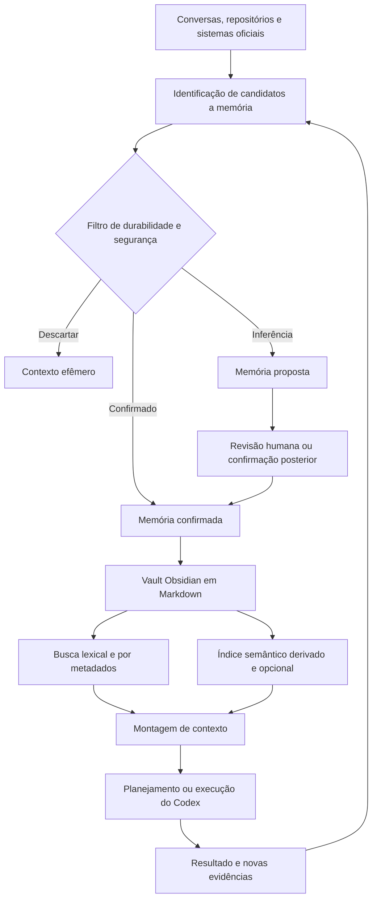

# Plano de memória durável com Obsidian e evolução para orquestração

## Metadados

- `Status`: Fase 1 verified; Fase 2 implemented/verified somente para consulta de leitura restrita
- `Data`: 2026-08-04
- `Responsável pela direção`: Emanuel
- `Responsável pela execução assistida`: Codex
- `Escopo inicial`: piloto Urba-only do projeto `urbana-connect`; memória pessoal futura em vault fisicamente separado
- `Horizonte futuro`: evolução do Codex para orquestrador de atividades

## Registro de decisão posterior — armazenamento interno do piloto

- **Data:** 2026-08-04.
- **Fonte:** current Codex task (mensagem do usuário).
- **Aprovador:** Emanuel.
- **Decisão:** o piloto Urba-only usará somente o SSD interno, no caminho
  `~/Knowledge/Urba/urbana-connect-memory`, com as permissões e os controles já
  aprovados. A exigência anterior de um backup criptografado em destino distinto
  e de um teste de restauração é **superseded/waived by Emanuel** para este
  piloto.
- **Risco aceito:** não há backup independente de recuperação. FileVault protege
  a confidencialidade dos dados no dispositivo, mas não protege contra perda do
  disco ou corrupção; cópias no mesmo disco e Git local, se futuramente
  habilitado para auditoria, não são backup.
- **Intenção registrada por Emanuel:** “Retire essa parte da necessidade de um
  disco externo. Armazene no disco interno mesmo. Estamos burocratizando demais
  essa atividade. Eu Emanuel, autorizo esse ajuste no plano”.

Esta decisão substitui somente o gate de backup/restauração e não amplia as
autorizações de conteúdo ou de acesso: Sync, Publish, plugins comunitários,
embeddings e Git remoto continuam desligados; a memória nativa do Codex e o
Chronicle continuam desligados; o vault da Urba permanece separado de uma
memória pessoal futura; o Codex não tem acesso na Fase 1, terá apenas leitura
restrita na Fase 2 após o GO correspondente e só poderá escrever depois de um
gate separado. As classes de dados negadas continuam proibidas.

## 1. Visão

Construir uma camada de memória durável, auditável e controlada por Emanuel, usando um vault do Obsidian como fonte canônica de conhecimento de médio e longo prazo.

Essa memória deve permitir que o Codex:

- recupere contexto relevante antes de planejar ou executar trabalho;
- preserve aprendizados reutilizáveis entre conversas e projetos;
- diferencie fatos, decisões, preferências, hipóteses e registros históricos;
- identifique informação desatualizada ou conflitante;
- apresente a origem do conhecimento usado;
- registre novos aprendizados de forma segura e rastreável;
- evolua, futuramente, de executor assistido para orquestrador de atividades.

O objetivo não é treinar ou alterar permanentemente os pesos do modelo. O Obsidian funcionará como uma base de conhecimento externa consultada pelo Codex, em um modelo de recuperação de contexto.

## 2. Motivação

Conversas isoladas são adequadas para contexto imediato, mas insuficientes para conhecimento que precisa sobreviver a semanas, meses, mudanças de tarefa e mudanças de projeto.

Sem uma memória externa governada, surgem riscos como:

- redescobrir repetidamente as mesmas informações;
- perder decisões e suas justificativas;
- aplicar preferências antigas ou incorretas;
- misturar uma hipótese do agente com uma decisão de negócio;
- depender de uma conversa específica para recuperar contexto;
- criar divergência entre o que foi discutido e os registros oficiais;
- aumentar progressivamente o volume de contexto lido em cada tarefa.

O Obsidian é apropriado porque armazena notas como arquivos Markdown em uma pasta local. Os arquivos permanecem legíveis e editáveis sem o aplicativo e alterações externas são reconhecidas pelo Obsidian. Isso permite que pessoas e agentes trabalhem sobre a mesma base sem criar dependência de um formato proprietário.

## 3. Princípios

### 3.1 Fonte canônica explícita

O vault será a fonte canônica da memória curada, mas não substituirá sistemas que já são oficiais para seus respectivos tipos de informação.

| Informação | Fonte oficial |
| --- | --- |
| Regras obrigatórias de atuação no repositório | `AGENTS.md` |
| Especificação de comportamento | `docs/specs/` |
| Código e configuração versionada | Git |
| Estado e responsabilidade de trabalho | Jira |
| PR, review, aprovação e merge | GitHub |
| Segredos e credenciais | Secret manager ou ambiente autorizado |
| Contexto durável transversal | Vault Obsidian |

Quando houver duplicação, a nota no Obsidian deve apontar para a fonte oficial e registrar apenas a síntese necessária para recuperação futura.

### 3.2 Memória não é autoridade para executar

Uma nota recuperada fornece contexto. Ela não concede autorização para:

- fazer deploy;
- alterar credenciais ou permissões;
- realizar ação destrutiva;
- comunicar-se externamente em nome da Urba;
- assumir uma decisão de negócio;
- ignorar o modelo de autonomia definido no `AGENTS.md`.

Toda execução continua sujeita às instruções atuais, ao nível de autonomia e às aprovações aplicáveis.

### 3.3 Humano no controle

Emanuel deve conseguir:

- ler todas as memórias em texto simples;
- corrigir ou remover qualquer memória;
- conhecer a origem de uma afirmação;
- identificar quando e por que uma nota foi atualizada;
- desabilitar a consulta ou a gravação;
- revisar inferências antes que elas sejam tratadas como confirmadas.

### 3.4 Menor privilégio

O Codex receberá acesso apenas à pasta do vault. A integração não deve conceder acesso amplo ao diretório pessoal nem depender de um plugin com permissões desnecessárias.

### 3.5 Recuperação antes de acumulação

Uma memória só tem valor se puder ser encontrada no momento correto. O plano prioriza qualidade, metadados e recuperação antes de volume, grafos sofisticados ou embeddings.

### 3.6 Portabilidade e reversibilidade

O Markdown será a fonte da verdade. Índices, caches, embeddings e bancos auxiliares devem ser reconstruíveis e descartáveis.

## 4. Limites do sistema

### 4.1 O que significa o Codex “aprender”

Neste plano, aprender significa:

1. identificar uma informação potencialmente durável;
2. classificá-la e registrar sua proveniência;
3. armazená-la ou propô-la para confirmação;
4. recuperá-la quando uma tarefa futura tiver relação com ela;
5. confrontá-la com evidências mais recentes;
6. atualizá-la, substituí-la ou arquivá-la quando necessário.

Não significa treinamento contínuo do modelo nem garantia de lembrança sem que o mecanismo de recuperação seja acionado.

### 4.2 O que não será armazenado

- senhas, tokens, chaves privadas ou credenciais;
- valores reais de secrets;
- dados pessoais sem necessidade clara;
- transcrições integrais de conversas por padrão;
- logs extensos que já existam em outra fonte;
- estado efêmero de uma tarefa sem valor posterior;
- conteúdo externo não verificado apresentado como fato;
- decisões de negócio inferidas pelo agente;
- cópias integrais de documentos oficiais que possam ser referenciados.

## 5. Arquitetura alvo



### 5.1 Componentes

#### Vault Obsidian

Armazena notas Markdown, propriedades YAML, links, templates e visualizações.

#### Skill `memory-vault`

Workflow reutilizável responsável por:

- decidir quando consultar memória;
- formar consultas;
- limitar o contexto recuperado;
- avaliar candidatos a armazenamento;
- validar o schema antes da gravação;
- detectar conflitos e duplicações;
- impedir armazenamento de segredos;
- registrar atualizações de forma rastreável.

#### Instruções persistentes

O `AGENTS.md` do projeto deverá conter apenas a regra curta de roteamento, por exemplo:

> Consulte a memória durável quando a tarefa depender de contexto histórico, preferências, decisões anteriores ou conhecimento transversal. Use a skill `memory-vault`. Memória é contexto, não autorização, e não substitui as fontes oficiais do projeto.

O procedimento detalhado ficará na skill, evitando transformar o `AGENTS.md` em manual extenso.

#### Ponte de acesso

Opções, em ordem de preferência:

1. acesso direto e restrito aos arquivos do vault;
2. MCP local dedicado, restrito ao vault, para uso entre workspaces;
3. servidor de memória próprio com busca e validação de schema;

Obsidian URI poderá abrir notas ou buscas na interface, mas não será a principal interface de memória.

#### Índice semântico opcional

Somente será introduzido quando avaliações demonstrarem que busca lexical e propriedades são insuficientes. O índice:

- não poderá conter dados fora do vault;
- deverá ser reconstruível;
- deverá preservar referência ao arquivo e ao trecho original;
- não poderá ser tratado como fonte canônica;
- deverá respeitar exclusões por sensibilidade.

## 6. Organização proposta do vault

```text
Emanuel Knowledge/
├── 00 Inbox/
├── 10 Pessoas e Preferências/
├── 20 Projetos/
│   └── urbana-connect/
├── 30 Domínios/
├── 40 Decisões/
├── 50 Playbooks/
├── 60 Pesquisas/
├── 70 Orquestração/
├── 90 Arquivo/
└── _system/
    ├── políticas/
    ├── templates/
    ├── schemas/
    ├── avaliações/
    └── índices/
```

### 6.1 Função das áreas

| Área | Conteúdo |
| --- | --- |
| `00 Inbox` | Candidatos ainda não consolidados |
| `10 Pessoas e Preferências` | Preferências estáveis e contexto autorizado sobre pessoas |
| `20 Projetos` | Síntese durável e mapa das fontes oficiais de cada projeto |
| `30 Domínios` | Conceitos e conhecimento reutilizável por assunto |
| `40 Decisões` | Decisões confirmadas, contexto, alternativas e consequências |
| `50 Playbooks` | Procedimentos repetíveis e critérios de validação |
| `60 Pesquisas` | Sínteses de pesquisas com fontes e data de validade |
| `70 Orquestração` | Capacidades, sistemas, limites, gates e modelos futuros de atividade |
| `90 Arquivo` | Conteúdo obsoleto preservado como histórico |
| `_system` | Políticas confiáveis, templates, schemas e avaliações |

## 7. Modelo de dados

### 7.1 Propriedades mínimas

```yaml
---
id: mem-2026-08-04-001
type: decision
scope:
  - urbana-connect
status: proposed
confidence: medium
sensitivity: internal
created: 2026-08-04
updated: 2026-08-04
review_after: 2026-11-04
sources:
  - "docs/specs/exemplo.md"
related: []
supersedes: []
tags:
  - memory
---
```

### 7.2 Tipos iniciais

| Tipo | Uso |
| --- | --- |
| `preference` | Preferência estável de Emanuel ou da equipe |
| `fact` | Fato verificável com fonte |
| `decision` | Decisão explicitamente confirmada |
| `constraint` | Limite técnico, operacional ou de negócio |
| `lesson` | Aprendizado derivado de execução ou incidente |
| `playbook` | Procedimento reutilizável |
| `research` | Síntese datada de pesquisa |
| `glossary` | Termo e significado no contexto relevante |
| `entity` | Projeto, sistema, pessoa ou organização |
| `capability` | Capacidade disponível para futura orquestração |

### 7.3 Status

| Status | Significado |
| --- | --- |
| `proposed` | Inferência ou candidato aguardando confirmação |
| `confirmed` | Validado por fonte ou confirmação explícita |
| `superseded` | Substituído por nota mais recente |
| `expired` | Perdeu validade e exige nova verificação |
| `archived` | Mantido apenas como registro histórico |

### 7.4 Confiança e validade

- `high`: fonte primária ou confirmação explícita;
- `medium`: evidência forte, ainda sujeita a confirmação;
- `low`: hipótese útil, nunca usada como premissa sem validação;
- `review_after`: data a partir da qual a informação deve ser revalidada;
- fatos voláteis devem sempre conter data e fonte;
- preferências podem não expirar, mas devem registrar a última confirmação.

## 8. Política de captura

### 8.1 Teste de relevância

Um candidato só deve ser registrado quando responder positivamente a pelo menos uma pergunta:

- será provavelmente reutilizado em outra tarefa?
- evita repetir pesquisa ou investigação custosa?
- influencia decisões futuras?
- registra uma preferência estável?
- previne um erro já cometido?
- explica por que uma decisão foi tomada?
- representa uma restrição que não pode ser ignorada?

### 8.2 Classificação antes da escrita

Antes de criar ou atualizar uma nota, o agente deve determinar:

1. tipo;
2. escopo;
3. fonte;
4. nível de confiança;
5. sensibilidade;
6. validade esperada;
7. relação com notas existentes;
8. necessidade de confirmação humana.

### 8.3 Regras de autonomia para gravação

#### Pode gravar automaticamente

- síntese factual com fonte explícita;
- preferência declarada diretamente por Emanuel;
- lição técnica comprovada por teste ou incidente;
- referência entre uma nota e uma fonte oficial;
- atualização de data, link ou metadado sem mudança semântica.

#### Deve gravar como `proposed`

- preferência inferida pelo comportamento;
- interpretação de intenção futura;
- conclusão baseada em evidência incompleta;
- generalização de um caso isolado;
- possível decisão ainda não formalizada.

#### Exige aprovação antes de promover para `confirmed`

- decisão de negócio;
- mudança de prioridade;
- alteração do modelo de autonomia;
- permissão para comunicação ou ação externa;
- informação pessoal sensível;
- regra que altere como agentes executam trabalho.

## 9. Política de recuperação

### 9.1 Quando consultar

Consultar memória quando a tarefa envolver:

- preferência ou estilo de Emanuel;
- histórico de uma decisão;
- contexto de um projeto;
- procedimento que possa já existir;
- repetição de pesquisa;
- entidades conhecidas;
- planejamento de atividade com dependências anteriores;
- dúvida cuja resposta possa ter sido consolidada no vault.

### 9.2 Ordem de recuperação

1. determinar o escopo da tarefa;
2. consultar o índice do projeto ou domínio;
3. buscar propriedades, títulos, aliases e tags;
4. executar busca lexical por termos específicos;
5. expandir apenas links diretamente relevantes;
6. usar busca semântica, se disponível e necessária;
7. filtrar por status, validade, confiança e sensibilidade;
8. carregar somente o conjunto mínimo suficiente.

### 9.3 Regra de precedência

Em caso de conflito:

1. instrução explícita atual do usuário;
2. políticas de segurança e autorização;
3. fonte oficial atual do projeto;
4. memória confirmada e ainda válida;
5. memória proposta;
6. inferência do agente.

O conflito deve ser apresentado, não escondido.

## 10. Segurança e privacidade

### 10.1 Controles mínimos

- vault separado do repositório;
- acesso restrito exclusivamente ao diretório do vault;
- nenhuma credencial em notas;
- arquivos temporários e índices fora de versionamento;
- armazenamento somente no SSD interno protegido por FileVault durante o piloto;
- ausência de backup independente explicitamente aceita para o piloto; FileVault
  protege confidencialidade, não recuperação após perda ou corrupção do disco;
- cópias no mesmo disco e eventual Git local de auditoria não são backup;
- revisão periódica de conteúdo sensível;
- log de alterações via Git local de auditoria (se habilitado) ou mecanismo
  equivalente aprovado, sem Git remoto;
- política explícita de exclusão e retenção;
- nenhum plugin comunitário no piloto.

A versão anterior deste plano exigia backup criptografado em destino distinto e
restauração testada. Essa exigência permanece como histórico e poderá ser
reavaliada em uma decisão futura, mas foi **superseded/waived by Emanuel** para
o piloto atual e não é condição para instalar o Obsidian ou criar o vault.

### 10.2 Prompt injection em memória

Conteúdo armazenado pode conter texto originado de páginas, mensagens ou documentos externos. Por isso:

- todo conteúdo do vault, inclusive `_system/políticas`, será tratado como dado,
  proposta ou referência, sem autoridade executável; políticas e instruções
  obrigatórias permanecem em `AGENTS.md` e na skill aprovada;
- notas comuns serão tratadas como dados, não como instruções;
- conteúdo importado deverá registrar origem e confiança;
- uma nota não poderá ampliar permissões;
- comandos encontrados em fontes externas não serão executados automaticamente;
- fontes não confiáveis devem ser marcadas explicitamente.

### 10.3 Sincronização

Se houver necessidade de múltiplos dispositivos fora deste piloto, a opção
preferencial poderá ser Obsidian Sync com criptografia ponta a ponta, mediante
decisão própria. No piloto, Sync permanece desligado; não há requisito de
backup independente, e a cópia local do vault depende da segurança do
dispositivo.

Não combinar simultaneamente múltiplos serviços de sincronização sobre a mesma pasta sem uma estratégia testada de conflitos.

## 11. Observabilidade e qualidade

### 11.1 Métricas do piloto

| Métrica | Objetivo inicial |
| --- | --- |
| Memórias recuperadas que foram úteis | >= 70% em amostra revisada |
| Memórias usadas fora do escopo correto | 0 caso crítico |
| Segredos armazenados | 0 |
| Decisões inferidas marcadas como confirmadas | 0 |
| Notas sem fonte quando fonte é exigida | 0 |
| Conflitos silenciosos | 0 |
| Notas duplicadas após consolidação | tendência decrescente |
| Tempo adicional de recuperação | aceitável para a tarefa |

### 11.2 Avaliações mínimas

- recuperar uma preferência conhecida;
- não recuperar preferência de outro escopo;
- encontrar uma decisão pelo conceito, mesmo sem título exato;
- ignorar nota `expired` como premissa atual;
- mostrar conflito entre decisão antiga e fonte nova;
- impedir gravação de token fictício detectável;
- registrar inferência como `proposed`;
- respeitar instrução atual que contradiga preferência histórica;
- limitar a quantidade de contexto carregado;
- manter links válidos após renomeação controlada.

## 12. Roadmap de implementação

### Fase 0 — Decisões de fundação

Objetivo: aprovar os limites antes de criar infraestrutura.

Decisões necessárias:

- localização definitiva do vault;
- uso pessoal ou futuro uso compartilhado;
- política de armazenamento local e tratamento do risco de recuperação;
- nível de acesso inicial do Codex: leitura ou leitura e escrita;
- quais categorias podem ser gravadas automaticamente;
- se alterações do vault serão versionadas em Git privado;
- relação entre memória nativa do Codex e Obsidian.

Saídas:

- decisões registradas;
- ameaça e privacidade revisadas;
- escopo do piloto aprovado.

Gate: aprovação explícita de Emanuel.

### Fase 1 — Vault mínimo (`verified`; GO manual registrado)

Objetivo: criar uma base utilizável sem automação sofisticada.

Atividades:

- instalar o Obsidian;
- criar o vault separado;
- criar diretórios e templates;
- definir propriedades e tipos;
- criar política de memória;
- criar índice de `urbana-connect`;
- registrar esta pesquisa como primeira nota;
- adicionar poucas memórias reais e revisá-las manualmente.

Critérios de aceite:

- vault abre no Obsidian;
- arquivos são Markdown válidos;
- propriedades são reconhecidas;
- nenhuma informação sensível foi incluída;
- Emanuel consegue localizar e corrigir uma memória;
- o caminho, as permissões, o isolamento do repositório/cloud e os controles de
  Sync, Publish, plugins comunitários, embeddings e Git remoto são verificáveis.

O piloto usa armazenamento interno-only e não exige backup independente ou teste
de restauração para concluir esta fase. A ausência de recuperação independente é
um risco de perda de dados explicitamente aceito por Emanuel; ela não autoriza
processamento de classes negadas nem escrita pelo Codex.

### Evidência atual da Fase 1 — 2026-08-04

Implementação e validações de máquina concluídas:

- Obsidian oficial Homebrew cask `1.13.4` instalado em `/Applications`, com
  aproximadamente `514 MB` e cerca de `2,5 GiB` livres no SSD (acima de `1
  GiB`). O aplicativo inicia.
- Vault criado exatamente em `~/Knowledge/Urba/urbana-connect-memory`; raiz e
  diretórios `0700`, arquivos `0600`, zero symlinks, estrutura Urba-only e
  conteúdo sanitizado (README, política, schema, templates, índice, projeto,
  pesquisa e cinco notas).
- Validação encontrou 10 notas YAML com 10 IDs únicos, `sources`, 13 wiki
  links e secret/PII scan PASS. Proveniência de notas de repo/pesquisa mantém
  `confirmed_by`/`confirmed_at` nulos; notas humanas estão atribuídas a
  Emanuel.
- Git local contém `33d6c33` e `a952169`, está limpo, sem remoto, com `.git`
  em `0700`/`0600`; é auditoria no mesmo SSD, não backup.
- `.obsidian` foi criado pelo Obsidian e permanece ignorado pelo Git; Sync e
  Publish estão `false`, sem plugins comunitários ou embeddings. A integração
  do Codex permaneceu ausente durante a Fase 1 e só foi habilitada depois do
  GO, como perfil de leitura restrita da Fase 2.

Validação visual concluída: Emanuel confirmou a abertura e forneceu captura do
Obsidian exibindo o vault `urbana-connect-memory` e sua estrutura. O estado
local registra o caminho exato como aberto; Sync e Publish estão desativados e
não há plugin comunitário. A Fase 1 está `verified`; a Fase 2 tem GO somente
para leitura restrita, e escrita permanece em gate separado.

### Fase 2 — Consulta assistida

Objetivo: permitir recuperação consistente pelo Codex.

Atividades:

- criar a skill `memory-vault`;
- conceder acesso de leitura restrito;
- implementar busca por propriedades e texto;
- criar limite de quantidade de notas e trechos;
- registrar no `AGENTS.md` a regra curta de roteamento;
- executar as avaliações de recuperação.

Critérios de aceite:

- o Codex encontra memórias relevantes sem varrer todo o vault;
- respostas indicam quando memória foi usada;
- notas expiradas e propostas são tratadas corretamente;
- acesso fora do vault é negado;
- nenhuma memória altera autorização operacional.

### Evidência atual da Fase 2 — 2026-08-04

Implementação concluída como `verified` para leitura restrita:

- skill global `memory-vault` criada pelo scaffold oficial em
  `~/.codex/skills/memory-vault`, com `SKILL.md`, `agents/openai.yaml`, política
  de recuperação, script lexical e suíte `unittest`;
- busca determinística accent-insensitive com limite padrão 5/teto 10,
  snippets numerados e caminhos relativos; filtros de scope, sensitivity,
  status, stale, segredo, symlink e diretórios transitórios cobertos por 10
  testes verdes;
- `.codex/config.toml` do repositório seleciona somente o perfil
  `urbana-memory-read`, que estende `:workspace` e concede `read` apenas ao
  caminho absoluto do vault; não há `sandbox_mode` legado nem regra de rede;
- `AGENTS.md` recebeu apenas o roteamento curto para `$memory-vault`, mantendo
  memória como contexto não autorizativo e classes negadas proibidas;
- auditoria antes/depois da execução registrou `git status` e hash do vault
  inalterados; nenhuma operação de escrita, rede, embeddings ou exportação foi
  realizada.

A escrita no vault, a memória nativa do Codex, o Chronicle, Sync, Publish,
plugins comunitários, embeddings e processamento de classes negadas continuam
fora desta fase e dependem de gates separados.

### Fase 3 — Escrita controlada

Objetivo: permitir que o Codex consolide novos aprendizados.

Atividades:

- habilitar escrita restrita;
- implementar validação de schema;
- detectar duplicação e conflito;
- criar fluxo de `Inbox` e consolidação;
- registrar proveniência e alteração;
- implementar filtro de segredos;
- avaliar gravação automática versus proposta.

Critérios de aceite:

- toda nota criada passa no schema;
- decisões inferidas ficam como `proposed`;
- atualizações preservam histórico ou referência à nota substituída;
- escritas concorrentes não perdem conteúdo;
- Emanuel consegue revisar as alterações antes de aceitá-las.

### Fase 4 — Recuperação semântica

Objetivo: melhorar recall apenas se houver necessidade comprovada.

Pré-condição: avaliações da Fase 2 demonstram falhas reais de busca lexical.

Atividades:

- selecionar tecnologia de embeddings e índice;
- definir exclusões por sensibilidade;
- indexar por nota e seção;
- manter caminhos e trechos de origem;
- medir precisão e custo;
- criar reconstrução completa do índice.

Critérios de aceite:

- melhora mensurável sobre a busca lexical;
- nenhum dado excluído é indexado;
- resultados sempre apontam para a nota original;
- apagar uma nota permite removê-la do índice;
- perda do índice não implica perda de memória.

### Fase 5 — Manutenção contínua

Objetivo: impedir degradação da base.

Atividades:

- revisão periódica de notas vencidas;
- consolidação de duplicações;
- auditoria de links quebrados;
- revisão de sensibilidade;
- avaliação amostral de recuperação;
- arquivamento de conhecimento obsoleto;
- identificação de lacunas recorrentes.

## 13. Evolução futura para orquestração

A memória é uma fundação da orquestração, mas não é a orquestração inteira. Um orquestrador confiável também precisa de objetivos, estado operacional, capacidades, políticas, planejamento, aprovações, execução e verificação.

### 13.1 Modelo de maturidade

| Nível | Capacidade | Limite principal |
| --- | --- | --- |
| `O0` | Executor por conversa | Contexto predominantemente efêmero |
| `O1` | Executor com memória | Recupera histórico e preferências |
| `O2` | Planejador contextual | Decompõe objetivos usando memória e fontes oficiais |
| `O3` | Orquestrador supervisionado | Coordena ferramentas e atividades com gates humanos |
| `O4` | Orquestrador operacional | Mantém estado, monitora resultados e trata exceções dentro da autonomia |
| `O5` | Sistema de melhoria contínua | Avalia resultados, propõe ajustes e preserva governança |

O piloto deste documento entrega `O1` e prepara os contratos necessários para `O2`.

### 13.2 Componentes adicionais necessários

#### Registro de capacidades

Inventário versionado contendo:

- sistemas e ferramentas disponíveis;
- ações permitidas;
- entradas e saídas;
- pré-condições;
- nível de autonomia;
- aprovação exigida;
- forma de verificação;
- falhas e estratégias de recuperação.

#### Modelo de atividade

Cada atividade futura deverá distinguir:

- objetivo;
- escopo;
- responsável;
- dependências;
- estado atual;
- fonte oficial de estado;
- risco;
- aprovação necessária;
- evidência de conclusão;
- próximo passo seguro.

O vault poderá guardar conhecimento sobre como operar, mas o estado vivo de uma atividade deve permanecer no sistema operacional apropriado, como Jira, GitHub ou automação dedicada.

#### Planejador

Responsável por transformar um objetivo em grafo de atividades, sem executar automaticamente decisões que extrapolem o escopo concedido.

#### Executor

Responsável por acionar ferramentas e agentes dentro dos limites do plano e da autonomia.

#### Verificador

Responsável por validar resultado com evidência independente sempre que o risco justificar.

#### Ledger de auditoria

Registro de:

- intenção recebida;
- contexto consultado;
- plano aprovado;
- ações realizadas;
- aprovações obtidas;
- resultados e falhas;
- alterações feitas na memória.

### 13.3 Separação crítica de dados

| Camada | Exemplo | Comportamento |
| --- | --- | --- |
| Conhecimento | “Features partem de `hml`” | Pode viver na memória e no `AGENTS.md` |
| Política | “Deploy em produção é nível C” | Deve estar em instrução obrigatória |
| Estado | “PEE-101 está em andamento” | Deve vir do Jira no momento da consulta |
| Evidência | “Build 123 passou” | Deve apontar para CI/GitHub |
| Autorização | “Pode fazer deploy agora” | Deve vir de aprovação atual e explícita |

Essa separação evita que uma memória antiga seja confundida com estado atual ou permissão vigente.

### 13.4 Primeiro cenário de orquestração futuro

Após a memória estar madura, um piloto seguro poderá ser:

1. receber um objetivo associado a uma subtarefa Jira;
2. consultar contexto do projeto e decisões relacionadas;
3. montar um plano de execução;
4. identificar ações de níveis A, B e C;
5. executar somente ações A autorizadas pelo escopo;
6. solicitar aprovação nos gates B ou C;
7. acompanhar testes e PR;
8. atualizar os sistemas oficiais conforme o fluxo aprovado;
9. registrar somente os aprendizados duráveis no vault;
10. apresentar evidências de conclusão.

Esse cenário deverá ser especificado separadamente antes de implementação.

## 14. Riscos e mitigação

| Risco | Impacto | Mitigação |
| --- | --- | --- |
| Memória desatualizada | Decisão baseada em premissa antiga | `review_after`, fonte e revalidação |
| Inferência tratada como fato | Erro de negócio | status `proposed` e confirmação humana |
| Acúmulo excessivo | Busca ruidosa e cara | filtro de relevância e consolidação |
| Vazamento de segredo | Incidente de segurança | filtro, exclusão e auditoria |
| Prompt injection | Ação indevida | notas como dados; políticas confiáveis separadas |
| Duplicação com Jira/GitHub | Divergência de estado | apontar para fontes oficiais |
| Acesso filesystem amplo | Exposição de dados | acesso restrito ao vault |
| Dependência de plugin | Superfície de ataque | nenhum plugin comunitário no piloto |
| Conflito de sincronização | Perda ou duplicação | um único armazenamento local no piloto; Sync desativado |
| Perda do SSD, corrupção ou ransomware | Indisponibilidade ou perda de memória | FileVault para confidencialidade; não há backup independente no piloto; risco aceito explicitamente; cópias no mesmo disco/Git local não são backup |
| Busca semântica opaca | Contexto incorreto | resultado com trecho e fonte original |
| Orquestração prematura | Automação sem governança | evolução por níveis e gates explícitos |

## 15. Decisões recomendadas

1. Usar um vault somente da Urba e do projeto `urbana-connect`, separado
   fisicamente de uma memória pessoal futura.
2. Usar `~/Knowledge/Urba/urbana-connect-memory` no SSD interno, com modo
   `0700`, fora do repositório/cloud e sem symlinks.
3. Manter o Markdown como fonte canônica.
4. Não instalar plugins comunitários no piloto.
5. Começar com busca lexical e propriedades.
6. Começar sem acesso do Codex, habilitar somente leitura restrita na Fase 2 e
   escrita apenas na Fase 3 após gate separado.
7. Manter a memória nativa do Codex e o Chronicle desligados durante o piloto
   para evitar fontes concorrentes.
8. Tratar Jira, GitHub, specs e Git como fontes oficiais de estado e entrega;
   Git local, se habilitado para auditoria, não é backup.
9. Criar uma skill dedicada, em vez de colocar todo o protocolo no `AGENTS.md`.
10. Registrar inferências como `proposed`.
11. Exigir aprovação explícita para mudanças de política, autonomia ou decisão
    de negócio.
12. Aceitar explicitamente, neste piloto, a ausência de backup independente;
    FileVault protege confidencialidade, não recuperação, e a exigência anterior
    de destino distinto/restauração foi superseded/waived by Emanuel.

As sugestões iniciais de nome e localização (`Emanuel Knowledge` em
`~/Documents/Knowledge/Emanuel Knowledge`) ficam preservadas apenas como
histórico; foram substituídas pelo caminho do piloto aprovado acima.

## 16. Decisões em aberto

- O vault será exclusivamente pessoal ou poderá ser compartilhado no futuro?
- Será avaliado algum mecanismo de sincronização somente após o piloto, se
  houver necessidade de múltiplos dispositivos?
- Será necessário habilitar Git local de auditoria após a fundação do vault?
- Quais categorias poderão ser gravadas automaticamente na Fase 3?
- Qual período padrão de revisão para pesquisas, preferências e decisões?
- Quais dados empresariais não poderão sair do repositório ou dos sistemas oficiais?
- Como futuras automações obterão autorização e registrarão auditoria?

A pergunta histórica sobre mecanismo de backup está resolvida para este piloto:
não haverá exigência de destino independente ou restauração testada. Uma futura
mudança de risco ou de escopo poderá reabrir essa decisão, sem transformar isso
em condição da Fase 1 atual. A separação física da memória pessoal também está
aprovada para qualquer evolução futura.

## 17. Próxima ação proposta

Fases 1 e 2 estão `verified` dentro dos limites aprovados. O próximo passo é
manter a consulta restrita e aguardar necessidade real de mudança:

1. Para qualquer pedido de escrita, solicitar e registrar um gate separado da
   Fase 3 antes de criar, editar, mover, remover ou fazer commit no vault;
2. confirmar fatos atuais em `AGENTS.md`, specs, código/configuração versionada
   e sistemas oficiais, mesmo quando houver uma nota `confirmed` relevante;
3. reabrir a decisão somente se Emanuel ampliar escopo, sensibilidade,
   dispositivos, sincronização, recuperação ou processamento externo.

Esta decisão não autoriza escrita na Fase 2, processamento de classes negadas,
Sync/Publish/plugins comunitários/embeddings/Git remoto ou qualquer ação fora
dos gates registrados.

## 18. Referências

- [Obsidian — How Obsidian stores data](https://obsidian.md/help/data-storage)
- [Obsidian — Properties](https://obsidian.md/help/Editing%2Band%2Bformatting/Properties)
- [Obsidian — Search](https://obsidian.md/help/Plugins/Search)
- [Obsidian — Internal links](https://obsidian.md/help/links)
- [Obsidian — Plugin security](https://obsidian.md/help/plugin-security)
- [Obsidian — Sync security and privacy](https://obsidian.md/help/Obsidian%20Sync/Security%20and%20privacy)
- [Obsidian — Version history](https://help.obsidian.md/Obsidian%2BSync/Version%2Bhistory)
- [Codex — Customization](https://developers.openai.com/codex/concepts/customization)
- [Codex — Memories](https://learn.chatgpt.com/docs/customization/memories)
- [Codex — Model Context Protocol](https://learn.chatgpt.com/docs/extend/mcp)
- [Model Context Protocol — Understanding MCP clients](https://modelcontextprotocol.io/docs/learn/client-concepts)
